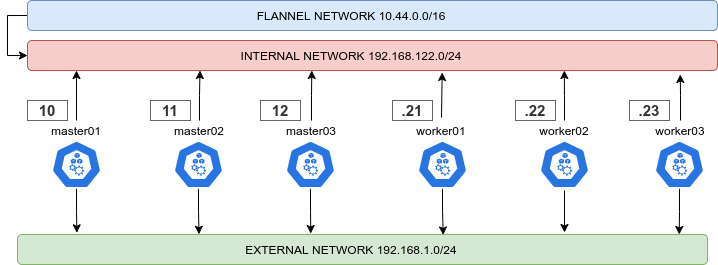

# K3s Lightweight Kubernetes made ready for production

This repo contains the playbook needed to set up an on-premises K3s cluster and securize it

## Included roles

### Hardening

There is an **hardening role**, that will target your nodes and securize them using best pratices from CIS Benchmark and STIG Guidelines.
You can use your own role or one of the official ansible available roles like:

- https://github.com/ansible-lockdown/RHEL8-STIG/
- https://github.com/ansible-lockdown/RHEL8-CIS/

It is possible to tweak the hardening using host-vars, mainly packages names (that depends on your distribution of choiche):

```yaml
aide_package: 'aide'
auditd_package: 'audit'
modprobe_package: 'kmod'
unwanted_pkg:
  - mcstrans
  - rsh
  - rsh-server
  - setroubleshoot
  - telnet-server
  - talk
  - tftp
  - tftp-server
  - xinetd
  - ypserv

kernel_packages:
  - kernel
  - kernel-headers
  - kernel-devel
```

And various tweaks on password aging, sessions timeout and so on.

### K3s Dependencies

This one will take care of setting up your cluster for K3s. Also here, adjust packages names accoring to your distribution of choiche:

```yaml
k3s_dependencies:
  - conntrack-tools
  - curl
  - ebtables
  - epel-release
  - ethtool
  - gawk
  - grep
  - ipvsadm
  - iscsi-initiator-utils
  - libseccomp
  - socat
  - util-linux
```

#### Dual Network

It is **highly recommended** to follow an internal/external network layout for your cluster, as showed in this little diagram



To enable this just give two different names to the internal and external interface, according to your distro of choiche naming scheme

```yaml
external_interface: eth0
internal_interface: eth1
```

Also you can decide here what CIDR should your cluster use

```yaml
cluster_cidr: 10.43.0.0/16
service_cidr: 10.44.0.0/16
```

## K3s Deploy

Lots of customization here, you can configure your Kubernetes cluster version

```yaml
k3s_version: v1.20.5+k3s1
```

You can configure your ingress hostnames, if not specified (default) it will use nip.io to resolve your IPs

```yaml
ingress_hostname: your.dns.name.io
```

You can (really have to) configure your MetalLB ip ranges here

```yaml
metallb_external_ip_range: 192.168.1.200-192.168.1.240
metallb_internal_ip_range: 10.10.90.100-10.10.90.240
```

Still referring to a dual-network layout. Just leave the internal one empty if not using a dual-layout one

You can then customize the keepalive VIP and interface

```yaml
keepalived_interface: eth0
keepalived_addr_cidr: 192.168.122.100/24
keepalived_ip: 192.168.122.100
```

And then a plethora of configs possible for **falco sidekick**. Refer to their docs (https://github.com/falcosecurity/falcosidekick) to customize your integrations

```yaml
falco_security_enabled: yes
falco_sidekick_slack: ""
falco_sidekick_slack_priority: "warning"
falco_sidekick_alertmanager: "..."
falco_sidekick_alertmanager_priority: "..."
falco_sidekick_discord: "..."
falco_sidekick_discord_priority: "..."
falco_sidekick_googlechat: "..."
falco_sidekick_googlechat_priority: "..."
falco_sidekick_kubeless_function: "..."
falco_sidekick_kubeless_namespace: "..."
falco_sidekick_kubeless_priority: "..."
falco_sidekick_mattermost: "..."
falco_sidekick_mattermost_priority: "..."
falco_sidekick_rocketchat: "..."
falco_sidekick_rocketchat_priority: "..."
falco_sidekick_slack: "..."
falco_sidekick_slack_priority: "..."
falco_sidekick_teams: "..."
falco_sidekick_teams_priority: "..."
```

# Final Result

This is the cluster layout at the end of the provisioning. Bear in mind that this is customizable in both versions and components


