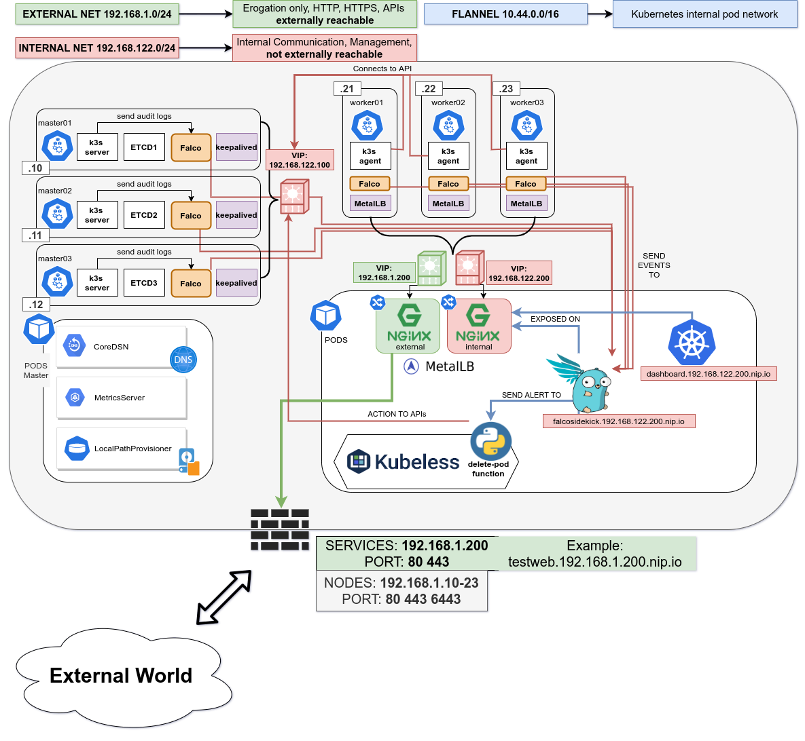
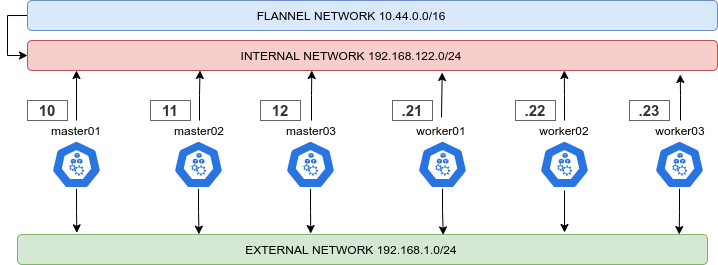

# K3s Lightweight Kubernetes — Production-Ready On-Premises

**Built and maintained by [Digitalis.io](https://digitalis.io)**

This repository contains an Ansible playbook that provisions a hardened, production-grade [k3s](https://k3s.io) Kubernetes cluster on bare metal or virtual machines. It targets RHEL 9, Rocky Linux 9, and CentOS Stream 9, and implements security controls aligned with CIS Benchmarks and STIG guidelines.

Read the accompanying blog series: [K3s Lightweight Kubernetes Made Ready for Production](https://digitalis.io/blog/kubernetes/k3s-lightweight-kubernetes-made-ready-for-production-part-1/)

---

## Table of Contents

- [Architecture Overview](#architecture-overview)
- [What's Included](#whats-included)
- [Requirements](#requirements)
- [Quick Start](#quick-start)
- [Inventory Structure](#inventory-structure)
- [Secrets Management](#secrets-management)
- [Roles](#roles)
  - [Hardening](#hardening)
  - [K3s Dependencies](#k3s-dependencies)
  - [K3s Deploy](#k3s-deploy)
- [Variables Reference](#variables-reference)
- [Dual-Network Layout](#dual-network-layout)
- [Terraform (Exoscale)](#terraform-exoscale)
- [Known Limitations](#known-limitations)
- [Professional Support](#professional-support)

---

## Architecture Overview

The default topology is a 3-master HA control plane with 3 worker nodes. kube-vip provides both the control-plane VIP and LoadBalancer IP address management, replacing the need for separate MetalLB and Keepalived installations.



---

## What's Included

| Component | Version | Notes |
| --- | --- | --- |
| k3s | v1.32.2+k3s1 | Multi-arch binary (amd64 / arm64) |
| kube-vip | v1.1.2 | Control-plane HA VIP + LoadBalancer IPs |
| kube-vip cloud provider | v0.0.12 | Allocates IPs to `LoadBalancer` services |
| Traefik | Built into k3s | Ingress controller (no separate deployment needed) |
| Portainer | v2.39.2 | Deployed via HelmChart CRD |
| Kubernetes Dashboard | v2.7.6 | Service account token compatible with Kubernetes 1.24+ |
| Falco | Latest | Runtime security |
| Falcosidekick | Latest | Alerting + automated pod deletion |
| OpenEBS | 2.8.0 | Local persistent storage |
| Pod Security Admission | — | Replaces deprecated Pod Security Policies |
| Ansible Vault | — | All secrets encrypted at rest |

---

## Requirements

- **Control machine**: Ansible 2.14+ with Python 3
- **Target OS**: RHEL 9, Rocky Linux 9, or CentOS Stream 9
- **SSH access**: Root or a user with passwordless sudo on all nodes
- **Ansible collections**:

```bash
ansible-galaxy collection install -r requirements.yml
```

This installs `ansible.posix` (>=1.5.4) and `community.general` (>=8.0.0).

---

## Quick Start

**1. Clone the repository**

```bash
git clone https://github.com/digitalis-io/k3s-on-prem-production.git
cd k3s-on-prem-production
```

**2. Copy and edit the example inventory**

```bash
cp inventory-k3s.yml my-inventory.yml
```

Fill in your node IP addresses and interface names. See [Inventory Structure](#inventory-structure) below.

**3. Create an Ansible Vault file for secrets**

```bash
ansible-vault create group_vars/kube_cluster/vault.yml
```

Add the following keys (use strong random values):

```yaml
vault_k3s_cluster_secret: "<base64-encoded-secret>"
vault_k3s_encryption_secret: "<base64-encoded-secret>"
vault_falco_sidekick_slack: "<slack-webhook-url>"
```

**4. Set non-secret cluster variables**

Edit `group_vars/kube_cluster/vars.yml`:

```yaml
k3s_version: v1.32.2+k3s1
external_interface: eth0
internal_interface: eth1
kubevip_external_ip_range: "192.168.1.200-192.168.1.240"
kubevip_internal_ip_range: "10.10.0.200-10.10.0.240"
hardening_enabled: true
```

**5. Run the playbook**

```bash
ansible-playbook -i my-inventory.yml cluster.yml --ask-vault-pass
```

To run only specific components, use tags:

```bash
# Bootstrap and deploy k3s only (skip hardening)
ansible-playbook -i my-inventory.yml cluster.yml --tags k3s,deploy --ask-vault-pass

# Run Falco deployment only
ansible-playbook -i my-inventory.yml cluster.yml --tags falco_security --ask-vault-pass

# Run load balancer setup only
ansible-playbook -i my-inventory.yml cluster.yml --tags loadbalancer --ask-vault-pass
```

---

## Inventory Structure

Use `inventory-k3s.yml` as your starting point. The playbook expects two host groups:

- `kube_master` — control-plane nodes (recommend 3 for HA)
- `kube_node` — worker nodes

```yaml
all:
  children:
    kube_cluster:
      children:
        kube_master:
          hosts:
            master01:
              ansible_host: 192.168.122.10
            master02:
              ansible_host: 192.168.122.11
            master03:
              ansible_host: 192.168.122.12
        kube_node:
          hosts:
            worker01:
              ansible_host: 192.168.122.21
            worker02:
              ansible_host: 192.168.122.22
            worker03:
              ansible_host: 192.168.122.23
```

---

## Secrets Management

All sensitive values are stored in an Ansible Vault-encrypted file at `group_vars/kube_cluster/vault.yml`. Non-secret variables live in `group_vars/kube_cluster/vars.yml` and reference vault variables using the `vault_` prefix convention:

```yaml
# vars.yml (committed, not encrypted)
k3s_cluster_secret: "{{ vault_k3s_cluster_secret }}"
k3s_encryption_secret: "{{ vault_k3s_encryption_secret }}"
```

```yaml
# vault.yml (encrypted, not committed in plain text)
vault_k3s_cluster_secret: "<secret>"
vault_k3s_encryption_secret: "<secret>"
```

To encrypt the vault file:

```bash
ansible-vault encrypt group_vars/kube_cluster/vault.yml
```

---

## Roles

### Hardening

Applies OS-level security controls to all nodes using CIS Benchmark and STIG guidelines. Hardening is optional but strongly recommended for production. Enable or disable it with:

```yaml
hardening_enabled: true   # set in group_vars/kube_cluster/vars.yml
```

You can substitute your own hardening role or use an official community role such as:

- https://github.com/ansible-lockdown/RHEL9-STIG
- https://github.com/ansible-lockdown/RHEL9-CIS

Key hardening variables (adjust package names for your distribution):

```yaml
aide_package: aide
auditd_package: audit
modprobe_package: kmod

unwanted_pkg:
  - mcstrans
  - rsh
  - rsh-server
  - setroubleshoot
  - telnet-server
  - talk
  - tftp
  - tftp-server
  - xinetd
  - ypserv

kernel_packages:
  - kernel
  - kernel-headers
  - kernel-devel
```

### K3s Dependencies

Installs prerequisite packages and prepares the OS for k3s. Adjust the package list for your distribution if needed:

```yaml
k3s_dependencies:
  - conntrack-tools
  - curl
  - epel-release
  - ethtool
  - gawk
  - grep
  - ipvsadm
  - iscsi-initiator-utils
  - libseccomp
  - nftables
  - socat
  - util-linux
  - wireguard-tools
```

This role also installs optional tooling on master nodes:

| Tool | Default version |
| --- | --- |
| kubectl | v1.31.0 |
| k9s | v0.32.5 |
| stern | 1.30.0 |

### K3s Deploy

Bootstraps and configures the k3s cluster, then deploys all in-cluster components.

---

## Variables Reference

### Core Cluster

| Variable | Default | Description |
| --- | --- | --- |
| `k3s_version` | `v1.32.2+k3s1` | k3s release to install |
| `cluster_external_ip` | `{{ ansible_host }}` | External IP of the first master, used for ingress defaults |
| `cluster_cidr` | `10.43.0.0/16` | Pod network CIDR |
| `service_cidr` | `10.44.0.0/16` | Service network CIDR |
| `external_interface` | auto-detected | External network interface name |
| `internal_interface` | auto-detected | Internal network interface name |
| `bind_address` | IP of `internal_interface` | Address k3s binds its API server and kubelet to |
| `advertise_address` | IP of `internal_interface` | Address k3s advertises to the cluster |
| `flannel_backend` | `wireguard-native` | Flannel overlay backend. See [Dual-Network Layout](#dual-network-layout) below. |

### Ingress

| Variable | Default | Description |
| --- | --- | --- |
| `ingress_hostname` | `{{ cluster_external_ip }}.nip.io` | Base hostname for ingress resources. Defaults to a nip.io address so no DNS configuration is required for a basic setup. |

### kube-vip

| Variable | Default | Description |
| --- | --- | --- |
| `kubevip_enabled` | `true` | Enable kube-vip deployment |
| `kubevip_version` | `v1.1.2` | kube-vip version |
| `kubevip_cloud_provider_version` | `v0.0.12` | kube-vip cloud provider version |
| `kubevip_interface` | `{{ ansible_default_ipv4.interface }}` | Interface to bind the VIP |
| `kubevip_vip_address` | `""` | Control-plane VIP address (leave empty if not using HA VIP) |
| `kubevip_external_ip_range` | Worker node IPs as /32 | IP range for external LoadBalancer services |
| `kubevip_internal_ip_range` | `""` | IP range for internal LoadBalancer services (optional) |

### Portainer

| Variable | Default | Description |
| --- | --- | --- |
| `portainer_version` | `2.39.2` | Portainer CE version |
| `portainer_ingress_host` | `portainer.{{ cluster_external_ip }}.nip.io` | Portainer ingress hostname |
| `portainer_ingress_class` | `traefik` | Ingress class to use |

### Falco Runtime Security

| Variable | Default | Description |
| --- | --- | --- |
| `falco_security_enabled` | `true` | Enable Falco and Falcosidekick |
| `falco_sidekick_slack` | `""` | Slack webhook URL for alerts |
| `falco_sidekick_slack_priority` | `warning` | Minimum Falco priority to send to Slack |
| `falco_sidekick_poddelete_minimumpriority` | `notice` | Minimum priority to trigger automated pod deletion |

Additional Falcosidekick integrations can be configured by setting any of these variables (see [Falcosidekick docs](https://github.com/falcosecurity/falcosidekick) for values):

```
falco_sidekick_alertmanager
falco_sidekick_alertmanager_priority
falco_sidekick_discord
falco_sidekick_discord_priority
falco_sidekick_googlechat
falco_sidekick_googlechat_priority
falco_sidekick_mattermost
falco_sidekick_mattermost_priority
falco_sidekick_rocketchat
falco_sidekick_rocketchat_priority
falco_sidekick_teams
falco_sidekick_teams_priority
```

### Storage

| Variable | Default | Description |
| --- | --- | --- |
| `openebs_storage_enabled` | `true` | Enable OpenEBS local storage |
| `openebs_version` | `2.8.0` | OpenEBS version |

### Dashboard

| Variable | Default | Description |
| --- | --- | --- |
| `dashboard_enabled` | `true` | Deploy Kubernetes Dashboard |

---

## Dual-Network Layout

Running a separate internal network for cluster traffic is strongly recommended for production. This keeps pod-to-pod and storage traffic isolated from the external network.



Configure the interface names to match your OS naming scheme:

```yaml
external_interface: eth0   # carries ingress and LoadBalancer traffic
internal_interface: eth1   # carries cluster-internal traffic
```

Set separate kube-vip IP ranges for each network:

```yaml
kubevip_external_ip_range: "192.168.1.200-192.168.1.240"
kubevip_internal_ip_range: "10.10.0.200-10.10.0.240"
```

Leave `kubevip_internal_ip_range` empty if you are using a single-network topology.

### Flannel backend

The default overlay network backend is `wireguard-native`, which encrypts all pod-to-pod traffic in transit using WireGuard. This is the recommended choice for production and is supported out of the box on RHEL 9 / Rocky 9 (WireGuard is built into the kernel).

```yaml
flannel_backend: wireguard-native   # default — encrypted overlay (WireGuard)
# flannel_backend: vxlan            # unencrypted VXLAN if WireGuard is unavailable
```

Required packages (`wireguard-tools` and `kernel-modules-extra`) are installed automatically by the `k3s-dependencies` role. Firewall ports `51820/udp` and `51821/udp` are opened automatically.

---

## Terraform (Exoscale)

A Terraform configuration for provisioning nodes on [Exoscale](https://www.exoscale.com) is available under `terraform/exoscale/`. It outputs a ready-to-use `inventory.yaml` for this playbook.

```bash
cd terraform/exoscale
terraform init
terraform apply
# inventory.yaml is written automatically from the template
```

Adjust `variables.tf` for your instance sizes, zone, and security group requirements before applying.

---

## Known Limitations

- The `firewalld` tasks intentionally use the `command` module rather than the Ansible `firewalld` module. This is a documented workaround for an Ansible firewalld module bug.
- auditd is restarted via `/sbin/service auditd restart` (SysV path) rather than systemd. This is required to flush audit rules correctly on RHEL-family systems.
- The `--protect-kernel-defaults=true` k3s flag is mandatory for CIS compliance and cannot be removed.
- AES-CBC encryption at rest is used and remains supported in k3s v1.32.
- Kubeless support is present for backwards compatibility but is effectively a no-op. Kubeless reached end-of-life and has been superseded by Falcosidekick's built-in pod-delete action.

---

## Professional Support

This project is built and maintained by **[Digitalis.io](https://digitalis.io)** — a Kubernetes-native consultancy helping teams design, deploy, and operate cloud-native infrastructure.

If you need help with:
- Production Kubernetes deployments and hardening
- Managed Kubernetes and platform engineering
- Data infrastructure (Kafka, Cassandra, Elasticsearch, and more) on Kubernetes
- Migration from on-premises to cloud-native environments

Get in touch at [https://digitalis.io](https://digitalis.io). We are happy to help.

---

*Licensed under the terms in [LICENSE](./LICENSE).*
